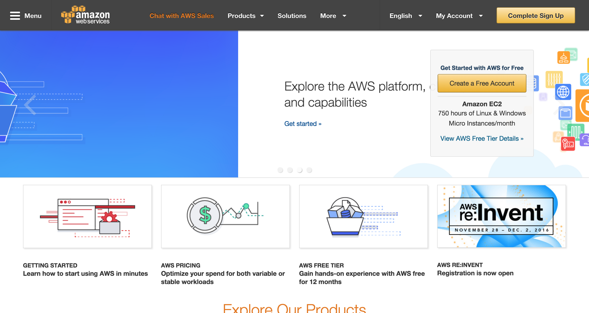
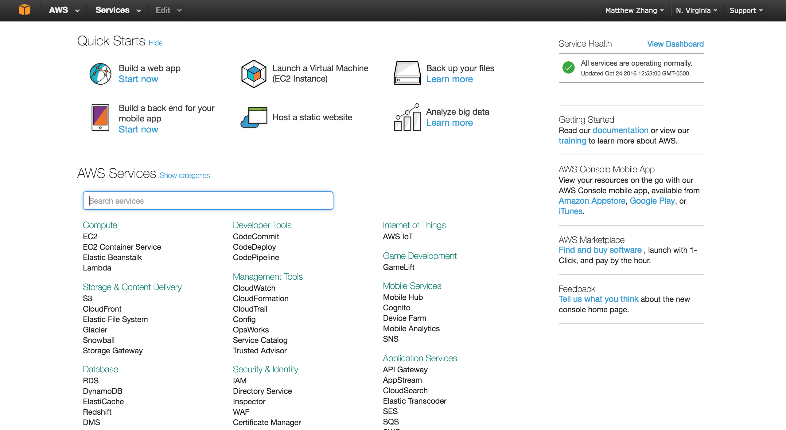
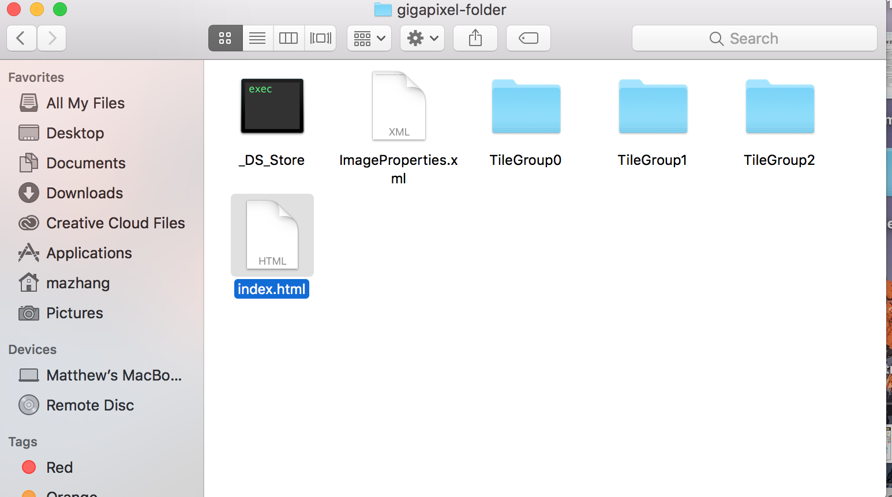
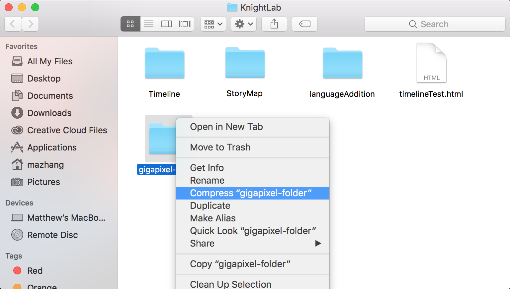
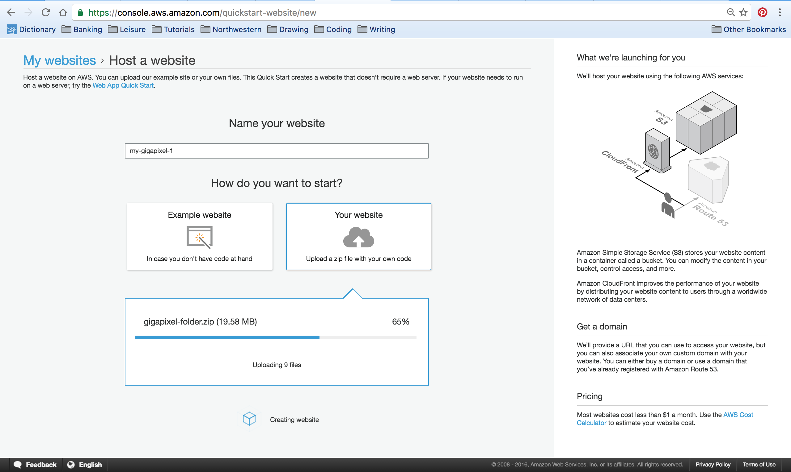
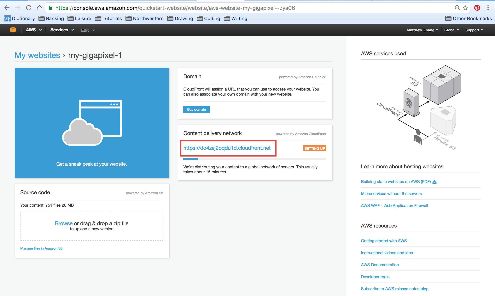
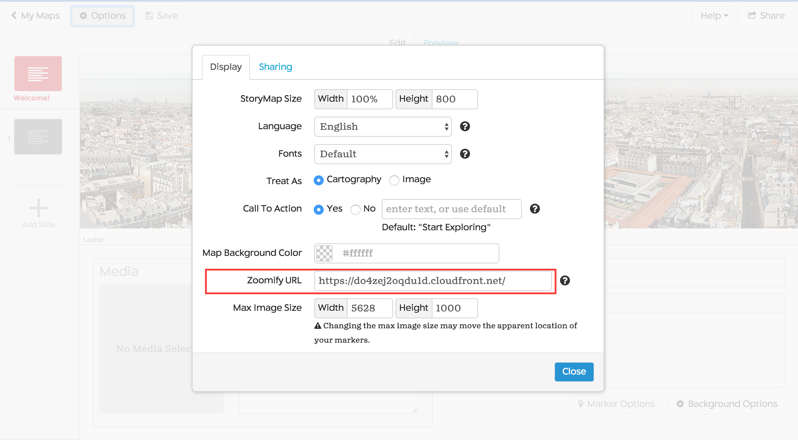

# Hosting your Gigapixel through Amazon Web Services

Before you can begin this process, you wil need to have generated Zoomify images. You can learn more about how to make one [here](/gigapixel/).

Note: While Amazon supports free web hosting through its Free Tier option, after a year, you will have to pay to use their hosting services. It's relatively cheap (~$.03 / month for 1 GB, using their [pricing calculator](https://calculator.s3.amazonaws.com/index.html), but if you want an entirely free option, you can check out our GitHub hosting tutorial [here](https://github.com/NUKnightLab/StoryMapJS/blob/master/GITHUB_HOSTING/GITHUB_HOSTING.md).

1. Sign up to create an account on [Amazon Web Services](https://aws.amazon.com/). If prompted, choose the 'Basic' account setting.

2. Once your account has been created, choose the 'Host a Static Website' option on your dashboard. You can also click [here](https://console.aws.amazon.com/quickstart-website/new) to go to the same place.

3. On your computer, navigate to the folder where you've stored your Gigapixel tiles. Inside the directory, create an empty file called 'index.html.'

4. Compress your Gigapixel image folder. On Macs, you can right-click and select the 'compress' option. On PCs, you should right-click and then select send > to compressed file.

5. Now, go back to the quickstart web hosting page, and upload your compressed folder.

6. Amazon will spend ~15 minutes to publish your Gigapixel to their servers, but once Amazon is done, they will provide you a link to your hosted webpage. The location of the link is highlighted in the red box below.

You're done! Use the [Storymap authoring tool](/select/) to create your Gigapixel and include the link to your Amazon webpage. If you need more information on best practices after creating your Gigapixel, you can read our documentation [here](https://github.com/NUKnightLab/StoryMapJS/blob/master/BEST_PRACTICES/BEST_PRACTICES.md).

/
