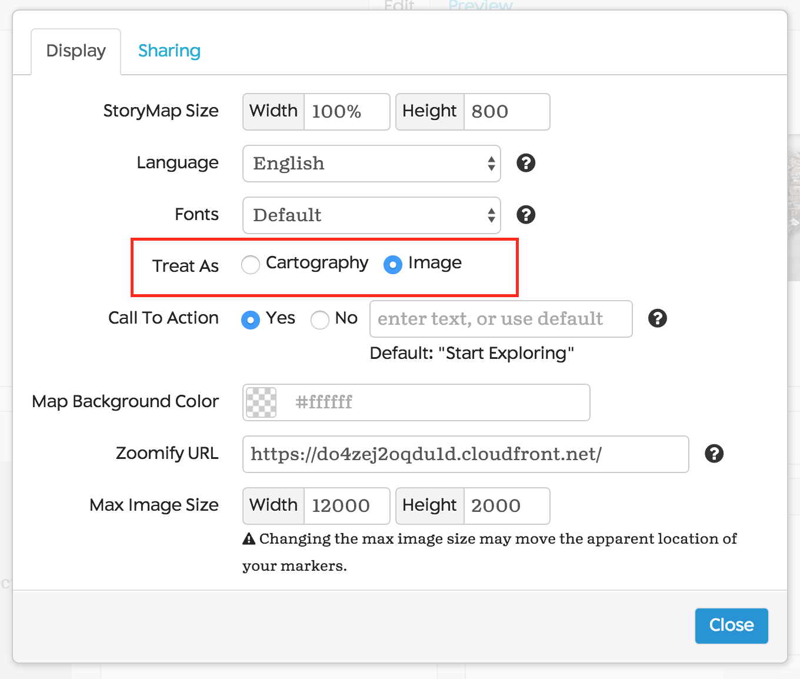
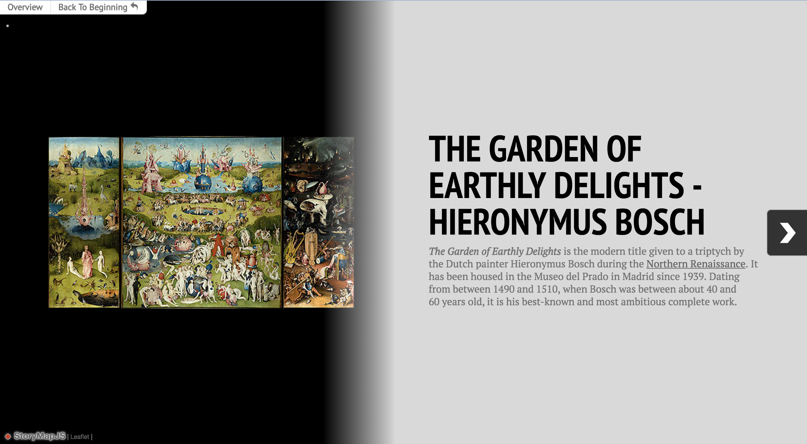
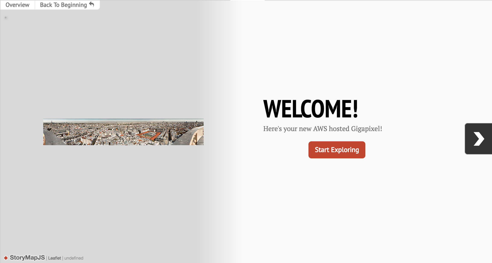
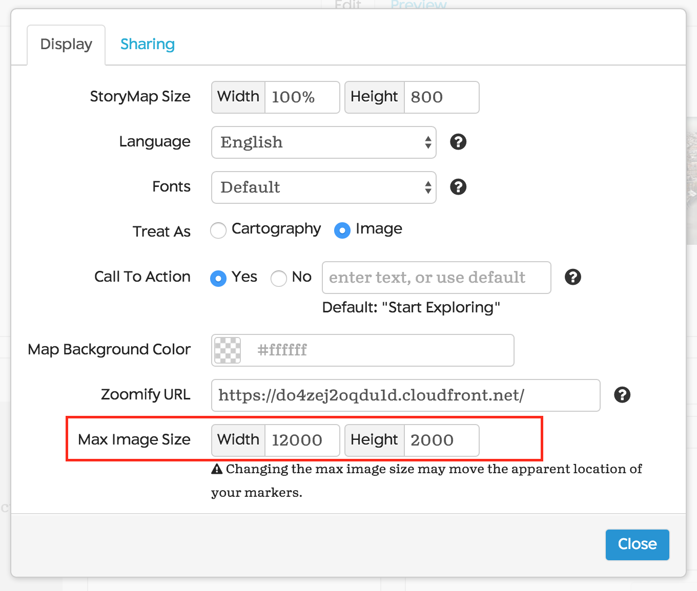

# Storymap Gigapixel Best Practices

After you’ve created a Gigapixel image through the process described [here](https://storymap.knightlab.com/gigapixel/), there are two options for displaying your Gigapixel in the Options Panel: ‘Image’ and ‘Cartography.’ While most of the features are the same in each mode, there are a few quirks of each mode that you might want to be aware of when creating your StoryMap.

## Best Practices for Image Mode:

In Image Mode, StoryMap markers are displayed only on hover, and path lines between markers are removed. Since these lines are removed, you should use this option if there is no spatial relationship between consecutive slides. 

For the overview image, your Gigapixel will be resized to fit only the left hand pane of your StoryMap. If you’re using an image that has a dimension that’s more than 5x the size of the other dimension, the image may be difficult to see. Thus, when choosing images for your Gigapixel, you should try to use images that have a width:length ratio of 3:1 or less. You may also want to avoid images that have excess margin, if you want to maximize the size of your image in the overview panel.

 versus 

If you want the image to fill the entire panel, you should choose an image that is sized in portrait view (2:3 or 1:2), rather than landscape. If none of these options work for you, you can use Cartography Mode instead.

## Best Practices for Cartography Mode:

In Cartography Mode, StoryMap markers will always be displayed, and path lines between consecutive markers will be displayed. You should use this mode if you want to emphasize the spatial relationship between events, or if you want to customize sizing without the constraints of Image Mode.

For the Cartography overview image, your Gigapixel will be resized so that all of your markers will be displayed in the left hand pane, making it possible for your image to fill the entire screen.

If you want to have your map fill the entire screen in the overview, the best way to do this is to have your markers concentrated on a single area of your map. For example, in the Arya’s Journey Gigapixel, the map markers were concentrated in the left-hand side of the map, allowing the right-hand side to fill up the rest of the screen. 

If you’re having trouble aligning your map, you can also tweak the maximum width and length of your map in the ‘Options Panel,’ which will adjust the display sizing. 

If your StoryMap is not displaying as described above, or if you have any other questions/bugs regarding Gigapixel displays, reach out to us at Zendesk!

