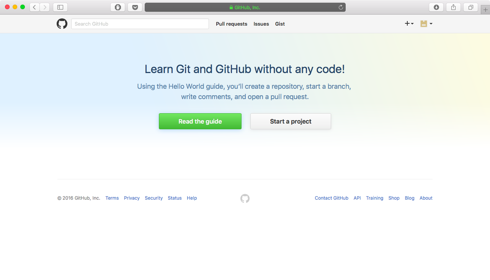
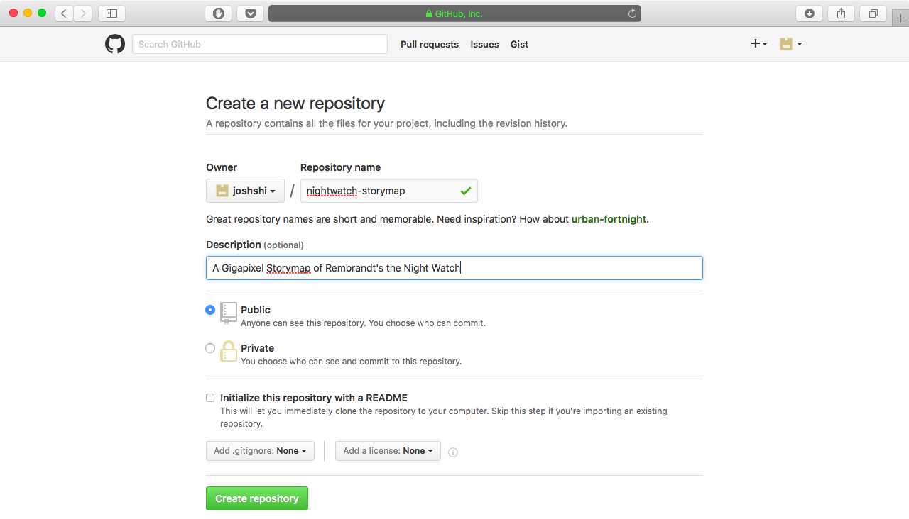
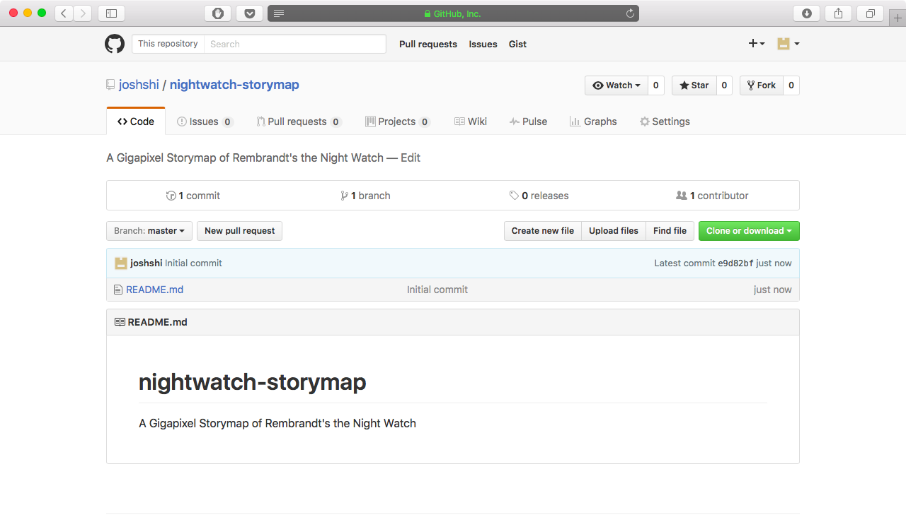
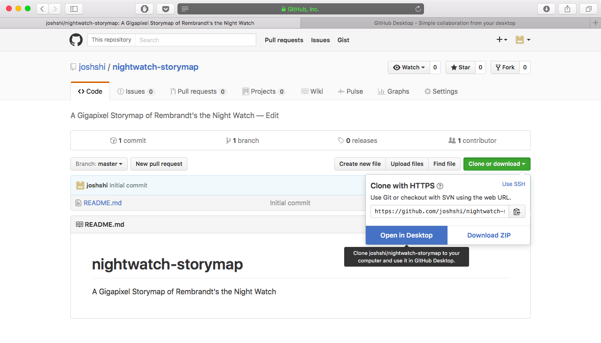
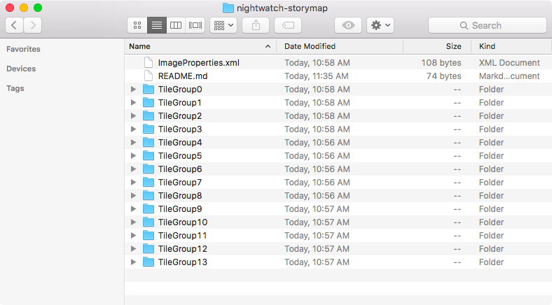
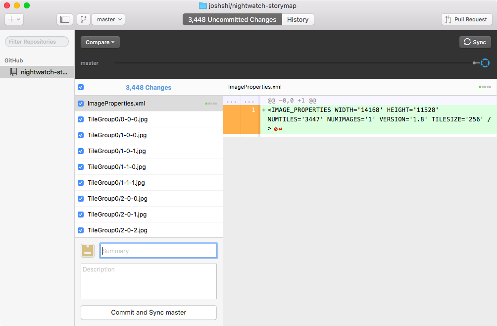
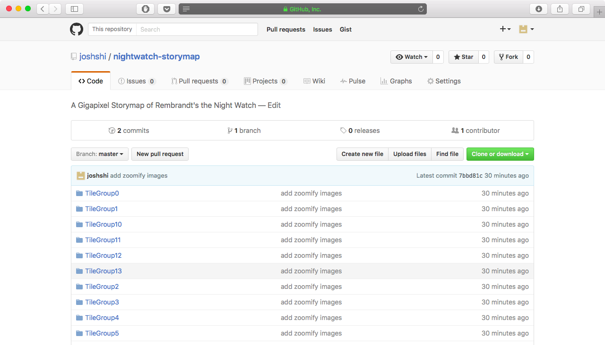
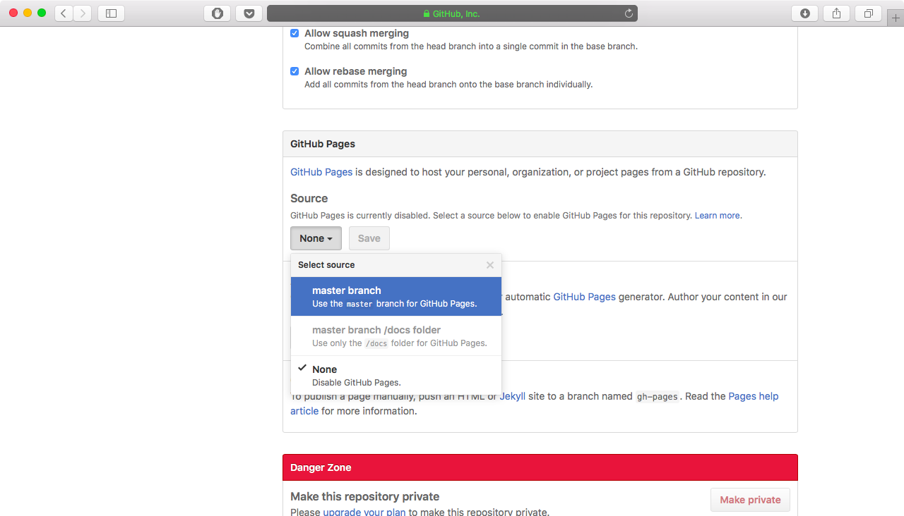
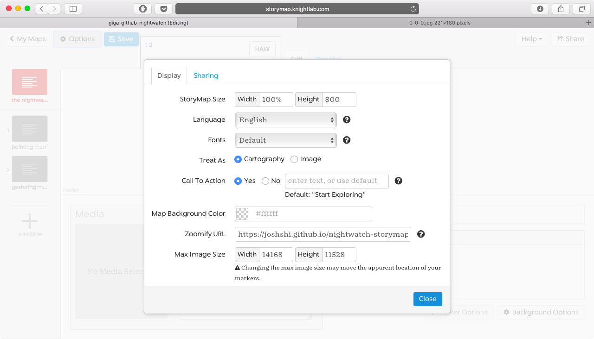
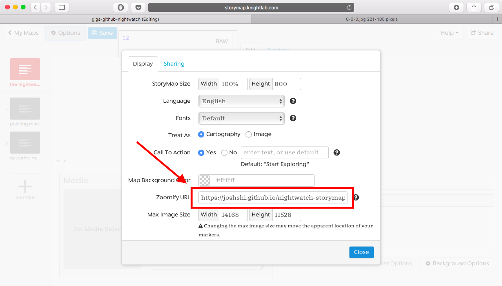

# Hosting your Gigapixel through GitHub

Before you can begin this process, you will need to have generated Zoomify images. You can learn more about how to make one [here](https://storymap.knightlab.com/gigapixel/).

1. Sign up to create an account on GitHub. A free account is fine. If you already have an account, sign in.

2. Start a new project either by pressing the “Start a project” button or, if you already have a GitHub account, clicking on the plus sign in the top right and selecting “New repository.”

3. Create your new repository and give it an identifying name. Make sure your repository is set to public. Check the box to initialize your repository with a README. A repository is just a place for us to store our files. In our case, we'll be uploading our Zoomify images to this repository.

*Your newly created repository should look like this, and contain one file named README.md.*

4. If you’re new to GitHub, download [GitHub Desktop](https://desktop.github.com). Then go to the “Clone or download” button and click “Open in Desktop.” If you're comfortable using GitHub through the command line, you can clone the repository like normal, move your Zoomify images to your cloned folder, commit and push, and skip to step 7.

*Clicking "Open in Desktop" should automatically launch the GitHub Desktop application.*

5. Once you have your project repository cloned, you can right-click the repository name and select “Open in Finder.” This is the folder on your computer where you will place your Zoomify images, and it should already have one file in it: the README we created in step 3. Once you’ve located the folder on your computer, move all the files and folders generated by Zoomify into your repository folder. After you've done so, your folder should look something like this, with a `README.md`, an `ImageProperties.xml` and all your TileGroup folders.

*Move or copy everything from your Zoomify folder to your cloned folder.*

6. Go back to the GitHub Desktop application. You should now have a tab at the top of your screen that says “X Uncommitted Changes.” In the “Summary” field, type a descriptive message of your content. Then click “Commit and Sync master” to upload your files. (Note: the button may be disabled for a while after clicking “Commit and Sync master” if you have a lot of images to upload. This is normal).

*Your GitHub Desktop application should display all the files you moved into cloned folder.*

*After clicking "Commit and Sync master," you should be able to see all your Zoomify files in your GitHub repository.*

7. Once your sync has completed, navigate to the settings tab and scroll down to the “GitHub Pages” section. Create a page for your project by selecting the source branch (master) and clicking “Save.” After the page refreshes, scroll back down to the GitHub Pages section and you will find the url you can use to create your Gigapixel. (Note: clicking on this link directly will take you to an error page saying that GitHub can’t find what you’re looking for. This is normal.)

*Copy this link to use as your Zoomify URL.*

You're done! Use the [Storymap authoring tool](https://storymap.knightlab.com/select/) to create your Gigapixel and include your GitHub url.

*Paste the link you copied from GitHub into the "Zoomify URL" text box to complete the process.*
